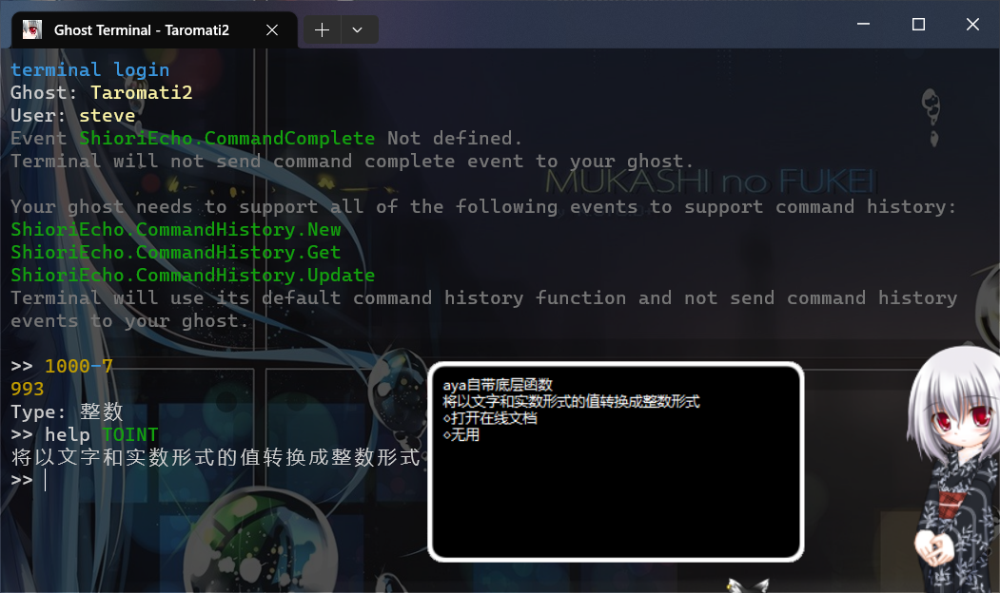

- [JP](./README_JP.md)  
- [EN](./README_EN.md)  

### ghost_terminal  
  
原试做品，现觉得有点用（  

### 用法  
如同系统终端般使用ghost_terminal  
up/down切换命令，鼠标右键快速粘贴，支持tab补全（如果人格支持）  
键入你的人格所支持的表达式随后对其求值！  
便于人格开发  

#### 命令行参数（Ver10后）  
```bat
ghost_terminal.exe -g ghost_name -c command
# or
ghost_terminal.exe -gh ghost_hwnd -c command
# or（Ver11后）
ghost_terminal.exe [-gh | -g] ghost -s sakura-script
```
比如：  
```bat
//...
..\saori\ghost_terminal.exe -g Taromati2 -c reload
@echo on
```
ghost_name 可以是Sakura（`\0`）端名称，或`ShioriEcho.GetName`返回的`GhostName`，（Ver11后）或descript.txt中的ghost名称  

### 需求  
支持`ShioriEcho`、`ShioriEcho.GetResult`的人格  
如[Taromati2]( https://github.com/Taromati2/Taromati2 )  
Ps：`ShioriEcho.GetName`、`ShioriEcho.End`、`ShioriEcho.TabPress`、`ShioriEcho.Begin`可选  

ghost_terminal通过`X-SSTP-PassThru-*`进行与人格间的信息沟通（见[文档]( http://ssp.shillest.net/ukadoc/manual/spec_shiori3.html )）  
相关约定与范例见下  

- `ShioriEcho`  
  命令键入完毕后事件  
  * `Reference0`  
	终端所收集到的命令  
  * 返值  
	忽略，**但言灵正常执行**  
  * 示例  
	```
	// request
	GET SHIORI/3.0
	Charset: UTF-8
	Sender: Ghost Terminal
	SenderType: external,sstp
	SecurityLevel: local
	Status: balloon(0=0)
	ID: ShioriEcho
	Reference0: 1000-7

	// response (Execution time : 0[ms])
	SHIORI/3.0 200 OK
	Sender: AYA
	Charset: UTF-8
	Value: \0\s[0]表达式『\_q1000-7\_q』的执行结果为：\n\_q993\n类型：整数\_q\n\q[◇复制结果,OnCopy,"993"]\n\q[◇复制表达式,OnCopy,"1000-7"]\n\q[◇结果作Sakura Script執行,OnSakuraScript,"993"]\n\n\q[◇求值下一个,OnCalculateVar]\n\q[◇无用,Cancel]\n\eb25jZSBzbyBkaXNwb3NhYmxl
	```
- `ShioriEcho.GetResult`  
  查询求值结果事件  
  * 可能返值1  
	- `X-SSTP-PassThru-Result`  
	  显示内容并进入下一命令的获取  
	- `X-SSTP-PassThru-Type`（可选）  
	  补充信息：值类型  
	- 示例  
	  ```
	  // request
	  GET SHIORI/3.0
	  Charset: UTF-8
	  Sender: Ghost Terminal
	  SenderType: external,sstp
	  SecurityLevel: local
	  Status: talking,balloon(0=0)
	  ID: ShioriEcho.GetResult

	  // response (Execution time : 0[ms])
	  SHIORI/3.0 200 OK
	  Sender: AYA
	  Charset: UTF-8
	  Value: 
	  X-SSTP-PassThru-Result: 993
	  X-SSTP-PassThru-Type: 整数
	  ```
  * 可能返值2  
	- `X-SSTP-PassThru-Special`  
	  显示内容并进入下一命令的获取  
	  Ver8后这个返回值将经过简单转义：  
	  * `\n` 将转换为换行  
	  * `\t` 将转变为制表符  
	  * `\\` 将转化为 `\`  
	- 示例  
	  ```
	  // request
	  GET SHIORI/3.0
	  Charset: UTF-8
	  Sender: Ghost Terminal
	  SenderType: external,sstp
	  SecurityLevel: local
	  Status: balloon(0=0)
	  ID: ShioriEcho.GetResult

	  // response (Execution time : 0[ms])
	  SHIORI/3.0 200 OK
	  Sender: AYA
	  Charset: UTF-8
	  Value: 
	  X-SSTP-PassThru-Special: 已取消求值
	  ```
  * 可能返值3  
	- 空  
	  等待1秒后重新发起`ShioriEcho.GetResult`  
  * 可能返值4  
	- **`SHIORI/3.0 400 Bad Request`**  
	  显示警告信息并进入下一命令的获取  
	  Ver9后：当ghost任意一次正常回应`ShioriEcho.GetResult`请求后，将忽略这样的回信并等待一秒，如同可能返值3一样  
- `ShioriEcho.GetName`  
  ghost_terminal获取名称时事件  
  Ver10前：ghost_terminal启动时事件  
  * `Reference0`(Ver10后)  
	终端版本  
  * 返值  
	- `X-SSTP-PassThru-GhostName`（可选）  
	  显示人格名  
	- `X-SSTP-PassThru-UserName`（可选）  
	  显示用户名  
  * 示例  
	```
	// request
	GET SHIORI/3.0
	Charset: UTF-8
	Sender: Ghost Terminal
	SenderType: external,sstp
	SecurityLevel: local
	Status: balloon(0=0)
	ID: ShioriEcho.GetName

	// response (Execution time : 0[ms])
	SHIORI/3.0 200 OK
	Sender: AYA
	Charset: UTF-8
	Value: 
	X-SSTP-PassThru-GhostName: Taromati2
	X-SSTP-PassThru-UserName: steve
	```
- `ShioriEcho.TabPress`  
  命令待补全时事件  
  * `Reference0`  
	终端所收集到的命令（光标前部分，其后部分不做传递）  
  * `Reference1`  
	用户连续第几次按下tab（起始值0）  
  * 返值  
	- `X-SSTP-PassThru-Command`（可选）  
	  光标前的命令替换为此内容  
  * 示例  
	```
	// request
	GET SHIORI/3.0
	Charset: UTF-8
	Sender: Ghost Terminal
	SenderType: external,sstp
	SecurityLevel: local
	Status: balloon(0=0)
	ID: ShioriEcho.TabPress
	Reference0: On
	Reference1: 0

	// response (Execution time : 0[ms])
	SHIORI/3.0 200 OK
	Sender: AYA
	Charset: UTF-8
	Value: 
	X-SSTP-PassThru-Command: OnNoMatchingEvent.DumpedList


	// request
	GET SHIORI/3.0
	Charset: UTF-8
	Sender: Ghost Terminal
	SenderType: external,sstp
	SecurityLevel: local
	Status: balloon(0=0)
	ID: ShioriEcho.TabPress
	Reference0: On
	Reference1: 1

	// response (Execution time : 0[ms])
	SHIORI/3.0 200 OK
	Sender: AYA
	Charset: UTF-8
	Value: 
	X-SSTP-PassThru-Command: OnNoMatchingEvent.IgnoreList


	// request
	GET SHIORI/3.0
	Charset: UTF-8
	Sender: Ghost Terminal
	SenderType: external,sstp
	SecurityLevel: local
	Status: balloon(0=0)
	ID: ShioriEcho.TabPress
	Reference0: 'Just a '+use 
	Reference1: 0

	// response (Execution time : 0[ms])
	SHIORI/3.0 200 OK
	Sender: AYA
	Charset: UTF-8
	Value: 
	X-SSTP-PassThru-Command: 'Just a '+username
	```
- `ShioriEcho.Begin`(Ver10后)  
  ghost_terminal对此ghost启动时事件  
  * `Reference0`  
	终端版本  
  * 返值  
	忽略，**但言灵正常执行**  
- `ShioriEcho.End`  
  ghost_terminal通过键入exit退出时事件  
  Ver9后：任何正常程序退出都会触发  
  * 返值  
	忽略，**但言灵正常执行**  

### 虚拟终端序列  
在Ver13后，任何的输出都将经过虚拟终端序列渲染，而不是普通的文本。  
参考：[虚拟终端序列](https://learn.microsoft.com/zh-cn/windows/console/console-virtual-terminal-sequences)  
你可以使用它来控制终端的显示效果，如文字颜色、背景色、字体等。

### 范例  
范例代码节选于Taromati2  
随意修改/复制/使用  
```aya
SHIORI_EV.On_Has_Event : void {
	SHIORI_FW.Make_X_SSTP_PassThru('Result',ISFUNC(reference0)||ISFUNC('On_'+reference0)||ISFUNC('SHIORI_EV.'+reference0)||ISFUNC('SHIORI_EV.On_'+reference0))
}
```
```aya
On_ShioriEcho.GetName:void {
	SHIORI_FW.Make_X_SSTP_PassThru('GhostName',ghostname)
	SHIORI_FW.Make_X_SSTP_PassThru('UserName',username)
}
On_ShioriEcho {
	ClearShioriEchoVar
	reference0 = reference.raw[0]
	case CUTSPACE(reference0){
		when 'reload'{
			ReloadFromTerminal=1
			OnReloadShiori
		}
		when 'errorlog'{
			OnErrorLog
			ShioriEcho.Result=GETERRORLOG
		}
		others{
			if RE_GREP(reference0,'^\s*(help|openfunc)\s+'){
				if RE_GREP(reference0,'^\s*help\s+'){
					_funcname=RE_REPLACE(reference0,'^\s*help\s+','')
					ShioriEcho.Special=Get_AYA_Function_Info(_funcname)
					if ShioriEcho.Special{
						'aya自带底层函数\n'+ShioriEcho.Special+'\n/
						\q[◇打开在线文档,OnUrlOpen,'+Get_AYA_Function_Doc(_funcname)+']\n/
						\q[◇无用,Cancel]\n/
						'
						--
						IgnoreChoiceTimeout
					}
					else
						ShioriEcho.Special='不是系统函数'
				}
				elseif RE_GREP(reference0,'^\s*openfunc\s+'){
					_funcname=RE_REPLACE(reference0,'^\s*openfunc\s+','')
					_info=GETFUNCINFO(_funcname)
					_path=SPLITPATH(_info[0])
					if _path
						_path=_path[2]+_path[3]
					else
						_path=_info[0]
					if _info!=-1{
						OnOpenDicWithLineNum(_info[0],_info[1])
						ShioriEcho.Special="打开%(_path)第%(_info[1])行"
					}
					else
						ShioriEcho.Special='不是用户函数'
				}
			}
			else{
				OnCalculateVar
				--
				IgnoreChoiceTimeout
			}
		}
	}
}
On_ShioriEcho.TabPress{
	_lastname=RE_REPLACE(reference0,'^[\s\S]*[\[\]\(\)\+\-\*\/\=\'+"'"+'\" ]','')
	_possible_names=IARRAY
	if !reference0[1,' ']
		_possible_names,=ARRAY.BeginAs(_lastname,'reload','errorlog','openfunc','help')
	if reference0[0,' '] == 'help'
		_possible_names=GETSYSTEMFUNCLIST(_lastname)
	elseif reference0[0,' '] == 'openfunc'
		_possible_names=GETFUNCLIST(_lastname)
	else
		_possible_names,=(GETVARLIST(_lastname),GETFUNCLIST(_lastname),GETSYSTEMFUNCLIST(_lastname))
	if ARRAYSIZE(_possible_names){
		_name_after_tab=_possible_names[reference1%ARRAYSIZE(_possible_names)]
		SHIORI_FW.Make_X_SSTP_PassThru('Command',RE_REPLACE(reference0,_lastname+'$',_name_after_tab))
	}
}
On_ShioriEcho.GetResult {
	if ISVAR('ShioriEcho.Special'){
		SHIORI_FW.Make_X_SSTP_PassThru('Special',ShioriEcho.Special)
		if !ShioriEcho.Special
			BUGNow('ShioriEcho.Special内容为空')
	}
	else{
		if ISVAR('ShioriEcho.Result'){
			SHIORI_FW.Make_X_SSTP_PassThru('Result',ValueTOstring(ShioriEcho.Result))
			SHIORI_FW.Make_X_SSTP_PassThru('Type',GETTYPE.string((ShioriEcho.Result)))
		}
	}
	ClearShioriEchoVar
}
ClearShioriEchoVar:void {
	ERASEALLVARBEGINAS('ShioriEcho.')
}
```
